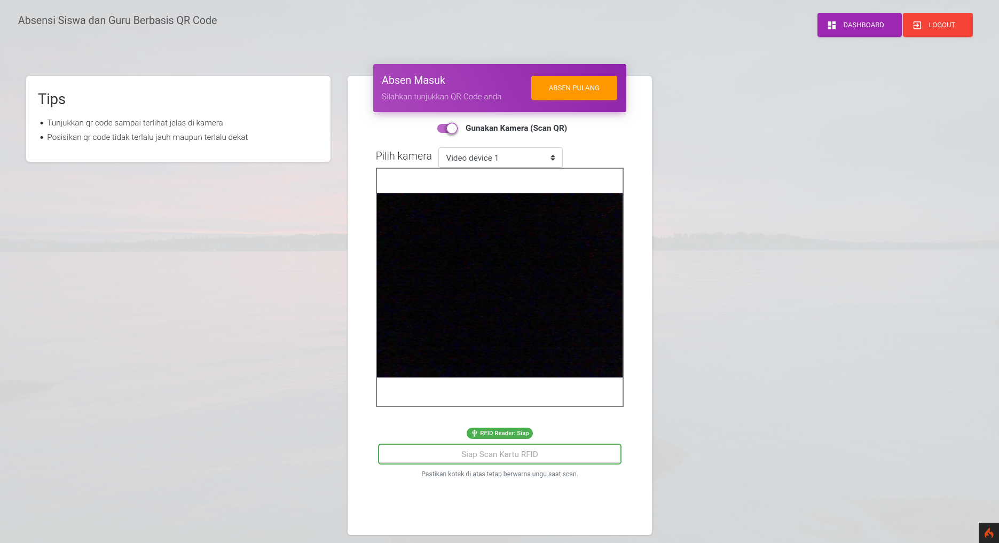
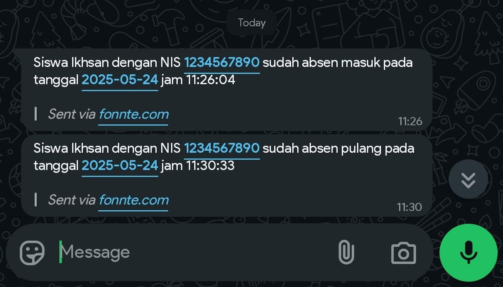
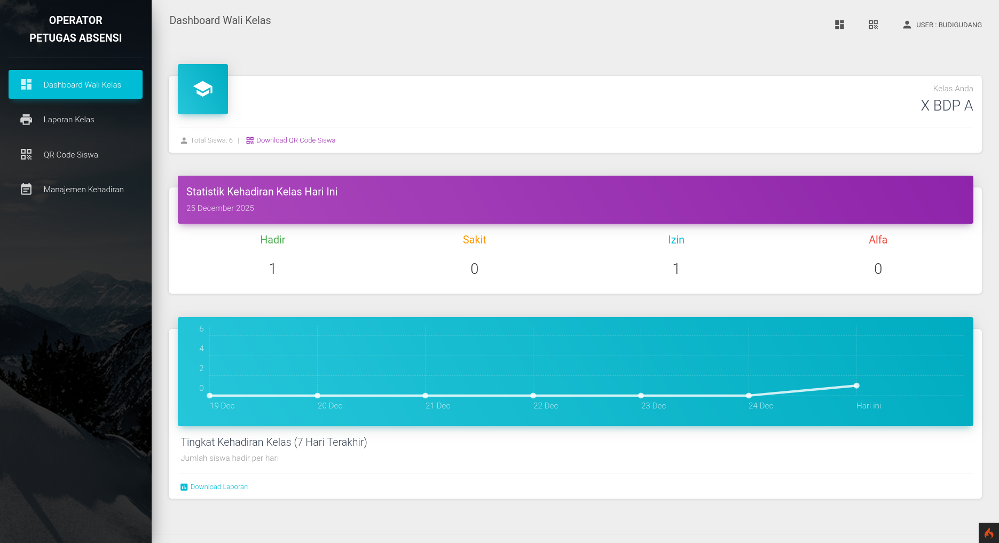
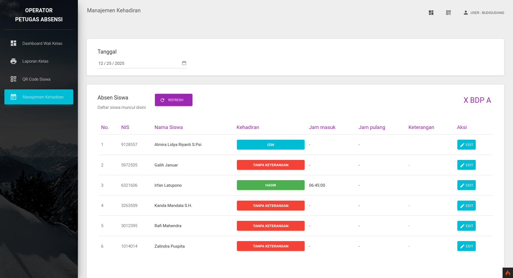
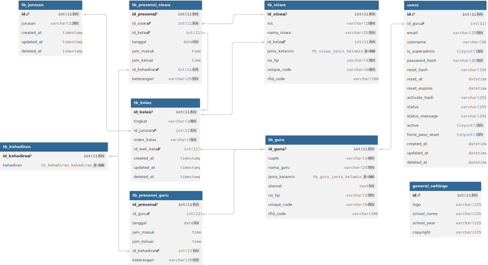

<h1 align="center">
  Aplikasi Web Sistem Absensi Sekolah<br>Berbasis QR Code (+ Dukungan RFID)
</h1>

<p align="center">
    <a href="https://github.com/ikhsan3adi/absensi-sekolah-qr-code/actions/workflows/ci.yml">
        
    </a>
    <a href="https://github.com/ikhsan3adi/absensi-sekolah-qr-code/stargazers">
        
    </a>
    <a href="https://github.com/ikhsan3adi/absensi-sekolah-qr-code/graphs/contributors">
        
    </a>
    <a href="https://github.com/ikhsan3adi/absensi-sekolah-qr-code/watchers">
        
    </a>
    <a href="https://github.com/ikhsan3adi/absensi-sekolah-qr-code/network/members">
        
</p>


Aplikasi Web Sistem Absensi Sekolah adalah sebuah proyek yang bertujuan untuk mengotomatisasi proses absensi di lingkungan sekolah. Aplikasi ini dikembangkan dengan menggunakan framework CodeIgniter 4 dan didesain untuk mempermudah pengelolaan dan pencatatan kehadiran siswa dan guru.

> [Instalasi & Cara Penggunaan](#cara-penggunaan)

## Fitur Utama

- **QR Code scanner.** Setiap siswa/guru menunjukkan qr code kepada perangkat yang dilengkapi dengan kamera. Aplikasi akan memvalidasi QR code dan mencatat kehadiran siswa ke dalam database.
- **RFID Integration.** Dukungan presensi menggunakan RFID card sebagai alternatif QR Code. Setiap siswa/guru dapat menggunakan RFID card untuk melakukan presensi dengan validasi kode RFID yang unik.
- **Notifikasi Presensi via WhatsApp**. Setelah berhasil scan dan presensi, pemberitahuan dikirim ke nomor hp siswa melalui whatsapp.
- **Login petugas.**
- **Dashboard petugas.** Petugas sekolah dapat dengan mudah memantau kehadiran siswa dalam periode waktu tertentu melalui tampilan yang disediakan.
- **Dashboard Wali Kelas.** Fitur khusus untuk guru wali kelas dengan kemampuan:
  - Memantau kehadiran siswa di kelas yang diampu
  - Mengelola data kehadiran siswa per kelas
  - Generate QR code untuk siswa di kelasnya
  - Generate laporan kehadiran khusus untuk kelas yang diampu
- **QR Code generator & downloader.** Petugas yang sudah login akan men-generate dan/atau mendownload qr code setiap siswa/guru. Setiap siswa akan diberikan QR code unik yang terkait dengan identitas siswa. QR code ini akan digunakan saat proses absensi.
- **Ubah data absen siswa/guru.** Petugas dapat mengubah data absensi setiap siswa/guru. Misalnya mengubah data kehadiran dari `tanpa keterangan` menjadi `sakit` atau `izin`.
- **Tambah, Ubah, Hapus(CRUD) data siswa/guru.**
- **Tambah, Ubah, Hapus(CRUD) data kelas.**
- **Lihat, Tambah, Ubah, Hapus(CRUD) data petugas.** (khusus petugas yang login sebagai **`superadmin`**).
- **Generate Laporan.** Generate laporan dalam bentuk pdf.
- **Import Banyak Siswa.** Menggunakan CSV delimiter koma (,), Contoh: [CSV](https://github.com/ikhsan3adi/absensi-sekolah-qr-code/blob/141ef728f01b14b89b43aee2c0c38680b0b60528/public/assets/file/csv_siswa_example.csv).

> [!NOTE]
>
> ## Framework dan Library Yang Digunakan
>
> - [CodeIgniter 4](https://github.com/codeigniter4/CodeIgniter4)
> - [Material Dashboard Bootstrap 4](https://www.creative-tim.com/product/material-dashboard-bs4)
> - [Myth Auth Library](https://github.com/lonnieezell/myth-auth)
> - [Endroid QR Code Generator](https://github.com/endroid/qr-code)
> - [ZXing JS QR Code Scanner](https://github.com/zxing-js/library)
>
> ---
>
> - [Fonnte](https://fonnte.com/) - WhatsApp API untuk mengirim pesan notifikasi

## Pratinjau

### Sistem Presensi

#### 1. Halaman Scanner (QR Code & RFID)

|                                (OLD) QR Scanner                                 |                            (NEW) QR Code + RFID                             |
| :-----------------------------------------------------------------------------: | :-------------------------------------------------------------------------: |
|  |  |

Halaman presensi yang mendukung **QR Code Scanner** (menggunakan kamera) dan **RFID Reader** (tap kartu).

#### 2. Hasil Presensi Masuk/Pulang (OLD)


#### 3. Notifikasi WhatsApp

<p align="center">
  
</p>

Notifikasi otomatis dikirim ke nomor HP siswa/guru setelah berhasil presensi.

---

### Dashboard Admin/Petugas

|               Login Petugas                |                 Dashboard Utama                 |
| :----------------------------------------: | :---------------------------------------------: |
|  |  |

Dashboard admin untuk monitoring kehadiran siswa dan guru.

---

### Manajemen Data Absensi

#### 1. Data Absensi Siswa & Guru

|         Absensi Siswa (Dengan Data Kelas)          |                   Absensi Guru                   |
| :------------------------------------------------: | :----------------------------------------------: |
|  |  |

#### 2. Edit Status Kehadiran

<p align="center">
  
</p>

Petugas dapat mengubah status kehadiran (Hadir, Sakit, Izin, Alpha, dll).

---

### Manajemen Data Master

#### 1. Data Siswa & Guru

|                    Data Siswa                    |                   Data Guru                    |
| :----------------------------------------------: | :--------------------------------------------: |
|  |  |

#### 2. Data Kelas & Jurusan


Kelola data kelas, jurusan, dan **penugasan Wali Kelas**.

---

### Fitur Tambahan

#### 1. Generate QR Code & Laporan

|               Generate QR Code                |                Generate Laporan                |
| :-------------------------------------------: | :--------------------------------------------: |
|  |  |

---

### Dashboard Wali Kelas

|                                 Dashboard Wali Kelas                                 |                          Manajemen Kehadiran Kelas                           |
| :----------------------------------------------------------------------------------: | :--------------------------------------------------------------------------: |
|                       |          |
| Dashboard khusus untuk guru wali kelas dengan statistik kehadiran siswa di kelasnya. | Wali kelas dapat melihat dan mengelola kehadiran siswa di kelas yang diampu. |

---

## Skema Database Inti



---

## Cara Penggunaan

### Persyaratan

- [Composer](https://getcomposer.org/).
- PHP 8.1+ dan MySQL/MariaDB atau [XAMPP](https://www.apachefriends.org/download.html) versi 8.1+ dengan mengaktifkan extension `intl` dan `gd`.
- Pastikan perangkat memiliki kamera/webcam untuk menjalankan qr scanner. Bisa juga menggunakan kamera HP dengan bantuan software DroidCam.

### Instalasi

#### 1. Clone/Download Repository

```bash
git clone https://github.com/ikhsan3adi/absensi-sekolah-qr-code.git
cd absensi-sekolah-qr-code
```

#### 2. Install Dependencies

Install semua dependencies menggunakan Composer:

```bash
composer install
```

#### 3. Konfigurasi Environment

- Jika belum ada file `.env`, copy dari `.env.example`:

  ```bash
  cp .env.example .env
  ```

- Edit file `.env` dan sesuaikan konfigurasi database:
  ```env
  database.default.hostname = localhost
  database.default.database = db_absensi
  database.default.username = root
  database.default.password =
  database.default.DBDriver = MySQLi
  ```

#### 4. Buat Database

Buat database baru di MySQL/MariaDB:

```sql
CREATE DATABASE db_absensi;
```

#### 5. Jalankan Migration

Migration akan membuat semua struktur tabel yang diperlukan:

```bash
php spark migrate --all
```

**Tabel yang akan dibuat:**

- `tb_jurusan` - Master jurusan
- `tb_kelas` - Data kelas
- `tb_kehadiran` - Master status kehadiran
- `tb_guru` - Data guru
- `tb_siswa` - Data siswa
- `tb_presensi_guru` - Presensi guru
- `tb_presensi_siswa` - Presensi siswa
- `users` - Akun pengguna (ditambah kolom `is_superadmin`, `id_guru`)
- `general_settings` - Pengaturan aplikasi

#### 6. Jalankan Seeder

Seeder akan mengisi data awal yang diperlukan:

```bash
php spark db:seed DatabaseSeeder
```

**Data yang akan di-seed:**

- Status kehadiran: Hadir, Sakit, Izin, Tanpa keterangan
- Jurusan: OTKP, BDP, AKL, RPL
- Kelas awal: X, XI, XII untuk semua jurusan
- Akun superadmin default
- Pengaturan umum aplikasi

#### 7. Jalankan Aplikasi

**Menggunakan PHP Built-in Server:**

```bash
php spark serve
```

Aplikasi akan berjalan di `http://localhost:8080`

**Atau menggunakan XAMPP/Apache:**

- Pastikan Apache dan MySQL sudah running
- Akses aplikasi melalui browser

#### 8. Login

Login menggunakan kredensial superadmin default:

```txt
Username: superadmin
Password: superadmin
Email: adminsuper@gmail.com
```

> **⚠️ PENTING:** Segera ubah password default setelah login pertama kali!

#### 9. Setup Tambahan

- **Izinkan akses kamera** untuk fitur QR Scanner
- **Untuk RFID**: Hubungkan RFID reader USB ke komputer
- **Untuk notifikasi WhatsApp**: Lihat bagian [Konfigurasi](#konfigurasi) di bawah

> 📖 **Untuk panduan lengkap tentang migration dan seeder**, lihat [MIGRATION_GUIDE.md](./MIGRATION_GUIDE.md)

### Cara Menggunakan Akun Wali Kelas

Fitur Wali Kelas memungkinkan guru untuk mengelola kehadiran siswa di kelas yang diampu. Berikut cara mengaktifkan dan menggunakan fitur ini:

#### Persiapan Data

Pastikan data berikut sudah tersedia:

- **Data Guru** sudah terdaftar di sistem
- **Data Kelas** sudah dibuat

#### Menautkan Guru sebagai Wali Kelas

1. Login sebagai **admin/superadmin**
2. Buka menu **Kelas & Jurusan** → **Data Kelas**
3. Klik tombol **Edit** pada kelas yang akan ditugaskan wali kelas
4. Pada dropdown **"Wali Kelas"**, pilih nama guru yang akan menjadi wali kelas
5. Klik **Simpan**

#### Menautkan Wali Kelas ke Akun Petugas

1. Login sebagai **superadmin**
2. Buka menu **Data Petugas**
3. Untuk membuat akun baru:
   - Klik **Tambah Petugas**
   - Isi data: Email, Username, Password
   - Pilih Role: **Admin** (bukan Superadmin)
   - Pada dropdown **"Hubungkan ke Guru"**, pilih nama guru
   - Klik **Simpan**
4. Untuk mengedit akun yang sudah ada:
   - Klik **Edit** pada akun petugas
   - Pada dropdown **"Hubungkan ke Guru"**, pilih nama guru
   - Klik **Update**

#### Login sebagai Wali Kelas

1. Logout dari akun superadmin
2. Login menggunakan **username dan password** yang sudah dibuat/dihubungkan ke data guru
3. Setelah login, sistem akan otomatis mendeteksi bahwa akun tersebut terhubung dengan data guru yang menjadi wali kelas
4. Dashboard Wali Kelas akan muncul dengan data kelas yang diampu

#### Fitur Dashboard Wali Kelas

Setelah login sebagai wali kelas, Anda dapat:

- **Melihat Statistik Kehadiran**: Grafik dan data kehadiran siswa di kelas yang diampu
- **Mengelola Kehadiran Siswa**: Lihat detail kehadiran setiap siswa per tanggal
- **Generate QR Code**: Download QR Code untuk siswa di kelas yang diampu
- **Generate Laporan**: Buat laporan kehadiran khusus untuk kelas yang diampu dalam format PDF

#### Catatan Penting

- Satu akun petugas hanya bisa dihubungkan ke **satu data guru**
- Guru yang belum ditugaskan sebagai wali kelas tidak akan melihat menu Dashboard Wali Kelas
- Wali kelas hanya dapat melihat dan mengelola data siswa di kelasnya sendiri
- Akun superadmin memiliki akses penuh ke semua fitur, termasuk fitur wali kelas

### Konfigurasi

> [!IMPORTANT]
>
> - Konfigurasi file `.env` untuk mengatur base url(terutama jika melakukan hosting), koneksi database dan pengaturan lainnya sesuai dengan lingkungan pengembangan Anda.
> - Untuk mengaktifkan **notifikasi WhatsApp**, pertama-tama ubah variabel `.env` berikut dari `false` menjadi `true`.
>
>   ```sh
>   # .env
>   # WA_NOTIFICATION=false # sebelum
>   WA_NOTIFICATION=true
>   ```
>
>   Lalu masukkan token WhatsApp API.
>
>   ```sh
>   # .env
>   WA_NOTIFICATION=true
>   WHATSAPP_PROVIDER=Fonnte
>   WHATSAPP_TOKEN=XXXXXXXXXXXXXXXXX # ganti dengan token anda
>   ```
>
>   _**Untuk mendapatkan token, daftar di website [fonnte](https://md.fonnte.com/new/register.php) terlebih dahulu. Lalu daftarkan device anda dan [dapatkan token Fonnte Whatsapp API](https://docs.fonnte.com/token-api-key/)**_
>
> - Untuk mengubah konfigurasi nama sekolah, tahun ajaran logo sekolah dll sudah disediakan pengaturan (khusus untuk superadmin).
> - Logo Sekolah Rekomendasi 100x100px atau 1:1 dan berformat PNG/JPG.
> - Jika ingin mengubah email, username & password dari superadmin, buka file `app\Database\Migrations\2023-08-18-000004_AddSuperadmin.php` lalu ubah & sesuaikan kode berikut:
>
>   ```php
>   // INSERT INITIAL SUPERADMIN
>   $email = 'adminsuper@gmail.com';
>   $username = 'superadmin';
>   $password = 'superadmin';
>   ```

## Docker Setup (Opsional)

Untuk menjalankan aplikasi menggunakan Docker, pastikan Docker dan Docker Compose sudah terinstal di komputer Anda.

### 1. Jalankan Container

Jalankan perintah berikut di root project:

```bash
docker-compose up -d --build
```

Perintah ini akan membangun image dan menjalankan container untuk aplikasi web, database, dan phpMyAdmin.

### 2. Akses Aplikasi

- **Aplikasi Utama**: Akses melalui browser di `http://localhost:8080/`
- **phpMyAdmin**: Akses melalui browser di `http://localhost:8081/`

### 3. Konfigurasi

Aplikasi sudah dikonfigurasi untuk terhubung dengan database container secara otomatis.
Default credential database:

- **Host**: `db`
- **Username**: `root`
- **Password**: `root`
- **Database**: `db_absensi`

### 4. Menghentikan Container

Untuk menghentikan container:

```bash
docker-compose down
```

## Kesimpulan

Dengan aplikasi web sistem absensi sekolah berbasis QR code ini, diharapkan proses absensi di sekolah menjadi lebih efisien dan terotomatisasi. Proyek ini dapat diadaptasi dan dikembangkan lebih lanjut sesuai dengan kebutuhan dan persyaratan sekolah Anda.

Jangan lupa beri star ya...⭐⭐⭐

## Contributing 🤝

Kami menerima kontribusi dari komunitas terbuka untuk meningkatkan aplikasi ini. Jika Anda menemukan masalah, bug, atau memiliki saran untuk peningkatan, silakan buat issue baru dalam repositori ini atau ajukan pull request.

## Donasi ❤

[](https://saweria.co/xiboxann)

## Star History

<a href="https://www.star-history.com/#ikhsan3adi/absensi-sekolah-qr-code&Date">
 <picture>
   <source media="(prefers-color-scheme: dark)" srcset="https://api.star-history.com/svg?repos=ikhsan3adi/absensi-sekolah-qr-code&type=Date&theme=dark" />
   <source media="(prefers-color-scheme: light)" srcset="https://api.star-history.com/svg?repos=ikhsan3adi/absensi-sekolah-qr-code&type=Date" />
   
 </picture>
</a>

## Kontributor 🛠️

- [@ikhsan3adi](https://www.github.com/ikhsan3adi)
- [@reactmore](https://www.github.com/reactmore)
- [@janglapuk](https://www.github.com/janglapuk)
- [@nanda443](https://www.github.com/nanda443)
- [@kevindoni](https://www.github.com/kevindoni)
- [@pandigresik](https://github.com/pandigresik)
- [@hex4coder](https://github.com/hex4coder)
