# Aplikasi Web Sistem Absensi Sekolah Berbasis QR Code

[](https://github.com/ikhsan3adi/absensi-sekolah-qr-code/actions/workflows/ci.yml)


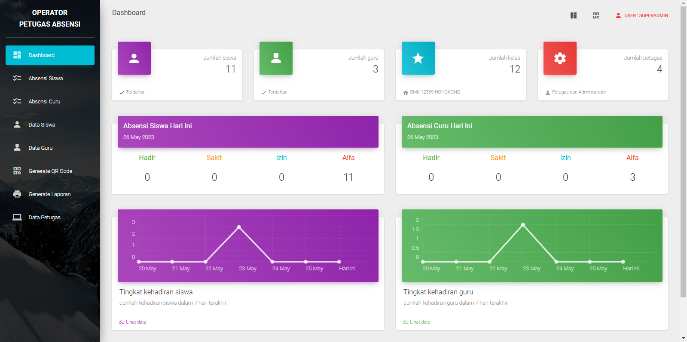

Aplikasi Web Sistem Absensi Sekolah Berbasis QR Code adalah sebuah proyek yang bertujuan untuk mengotomatisasi proses absensi di lingkungan sekolah menggunakan teknologi QR code. Aplikasi ini dikembangkan dengan menggunakan framework CodeIgniter 4 dan didesain untuk mempermudah pengelolaan dan pencatatan kehadiran siswa dan guru.

> [Instalasi & Cara Penggunaan](#cara-penggunaan)

## Fitur Utama

- **QR Code scanner.** Setiap siswa/guru menunjukkan qr code kepada perangkat yang dilengkapi dengan kamera. Aplikasi akan memvalidasi QR code dan mencatat kehadiran siswa ke dalam database.
- **Login petugas.**
- **Dashboard petugas.** Petugas sekolah dapat dengan mudah memantau kehadiran siswa dalam periode waktu tertentu melalui tampilan yang disediakan.
- **QR Code generator & downloader.** Petugas yang sudah login akan men-generate dan/atau mendownload qr code setiap siswa/guru. Setiap siswa akan diberikan QR code unik yang terkait dengan identitas siswa. QR code ini akan digunakan saat proses absensi.
- **Ubah data absen siswa/guru.** Petugas dapat mengubah data absensi setiap siswa/guru. Misalnya mengubah data kehadiran dari `tanpa keterangan` menjadi `sakit` atau `izin`.
- **Tambah, Ubah, Hapus(CRUD) data siswa/guru.**
- **Tambah, Ubah, Hapus(CRUD) data kelas.**
- **Lihat, Tambah, Ubah, Hapus(CRUD) data petugas.** (khusus petugas yang login sebagai **`superadmin`**).
- **Generate Laporan.** Generate laporan dalam bentuk pdf.
- **Import Banyak Siswa.** Menggunakan CSV delimiter koma (,), Contoh: [CSV](https://github.com/ikhsan3adi/absensi-sekolah-qr-code/blob/141ef728f01b14b89b43aee2c0c38680b0b60528/public/assets/file/csv_siswa_example.csv).


> [!NOTE]
>
> ## Framework dan Library Yang Digunakan
>
> - CodeIgniter 4
> - [Material Dashboard Bootstrap 4](https://www.creative-tim.com/product/material-dashboard-bs4)
> - [Myth Auth Library](https://github.com/lonnieezell/myth-auth)
> - [Endroid QR Code Generator](https://github.com/endroid/qr-code)
> - [ZXing JS QR Code Scanner](https://github.com/zxing-js/library)

## Screenshots

### Tampilan Halaman QR Scanner

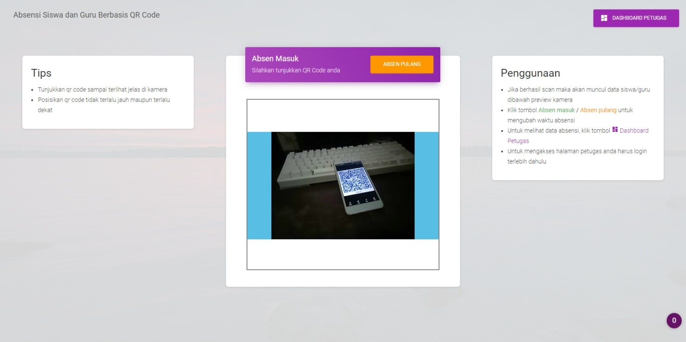

### Tampilan Absen Masuk dan Pulang

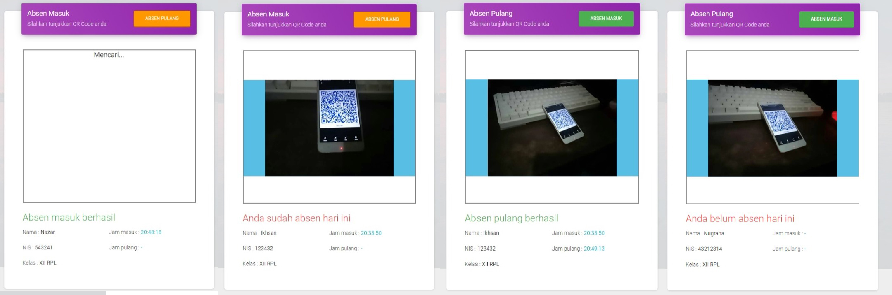

### Tampilan Login Petugas


### Tampilan Dashboard Petugas


### Tampilan CRUD Data Absen

| Siswa (Dengan Data Kelas)                          |                       Guru                       |
| -------------------------------------------------- | :----------------------------------------------: |
| 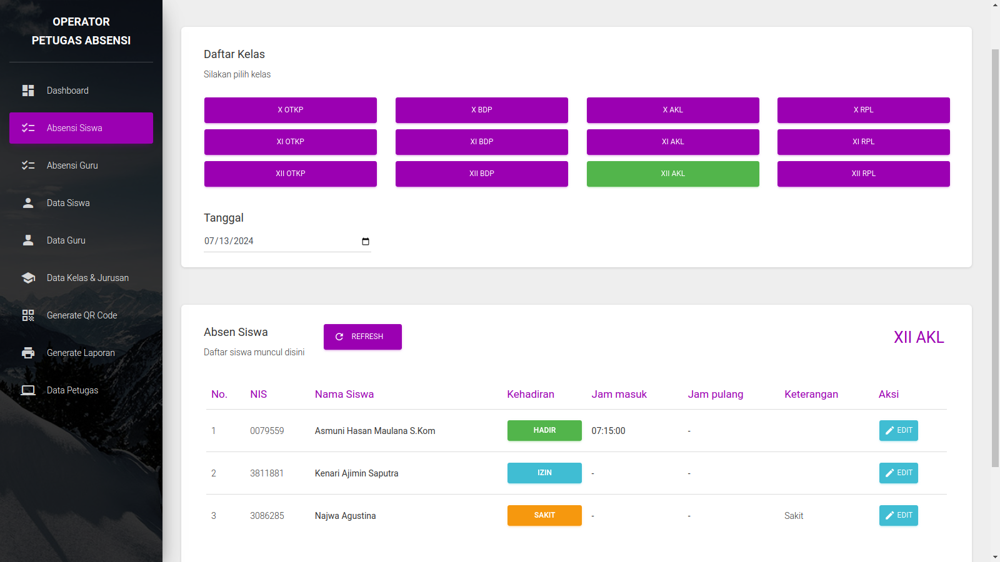 | 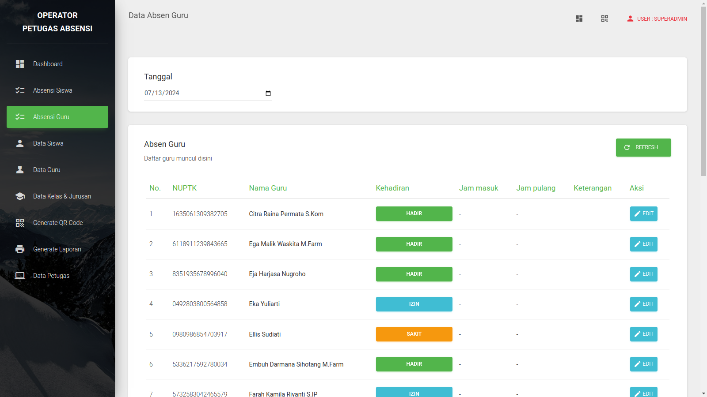 |

### Tampilan Ubah Data Kehadiran

<p align="center">
  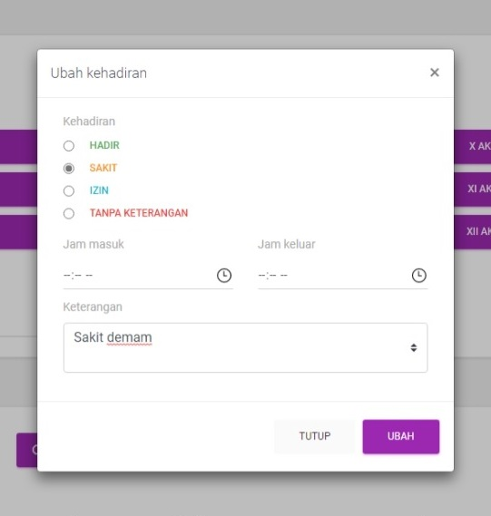
</p>

### Tampilan CRUD Data Siswa & Guru

| Siswa                                            |                      Guru                      |
| ------------------------------------------------ | :--------------------------------------------: |
| 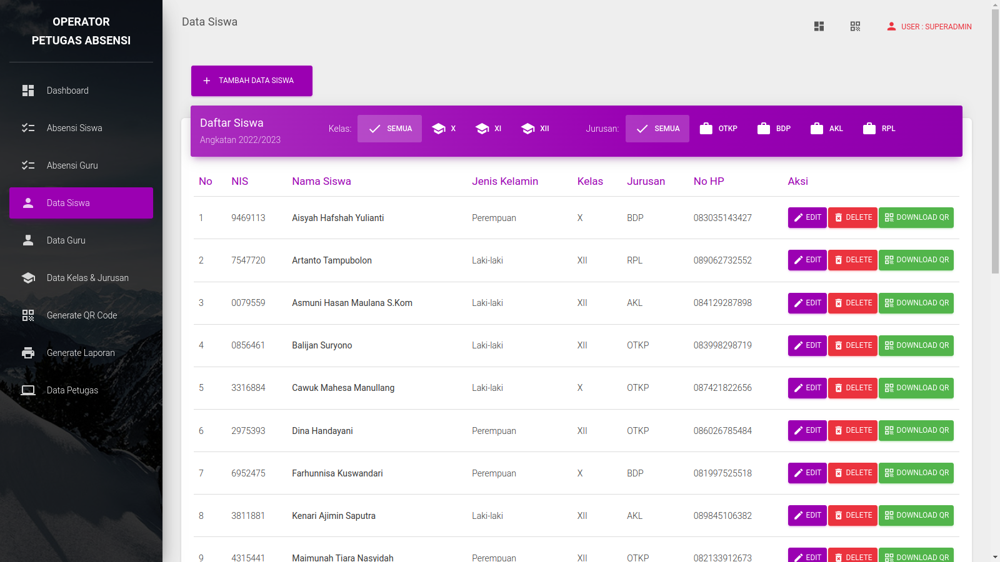 | 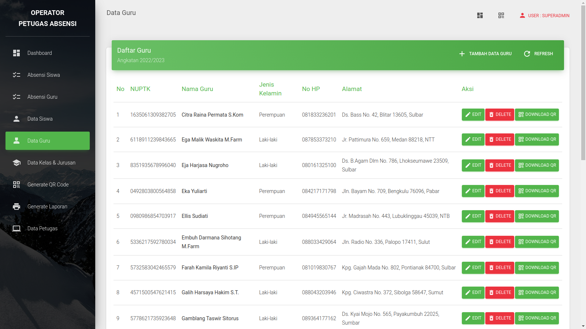 |

### Tampilan CRUD Data Kelas & Jurusan

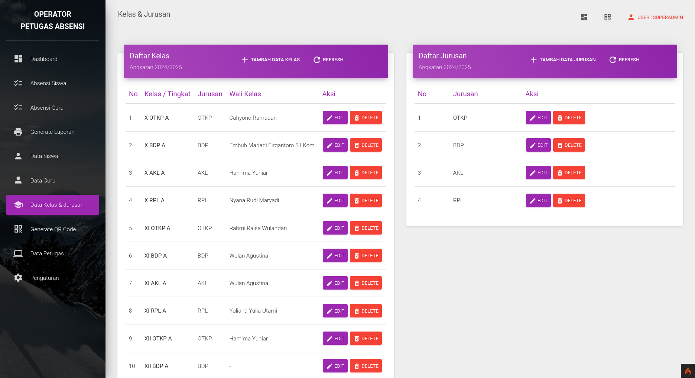

### Tampilan Generate QR Code dan Generate Laporan

| Generate QR                                   |                Generate Laporan                |
| --------------------------------------------- | :--------------------------------------------: |
| 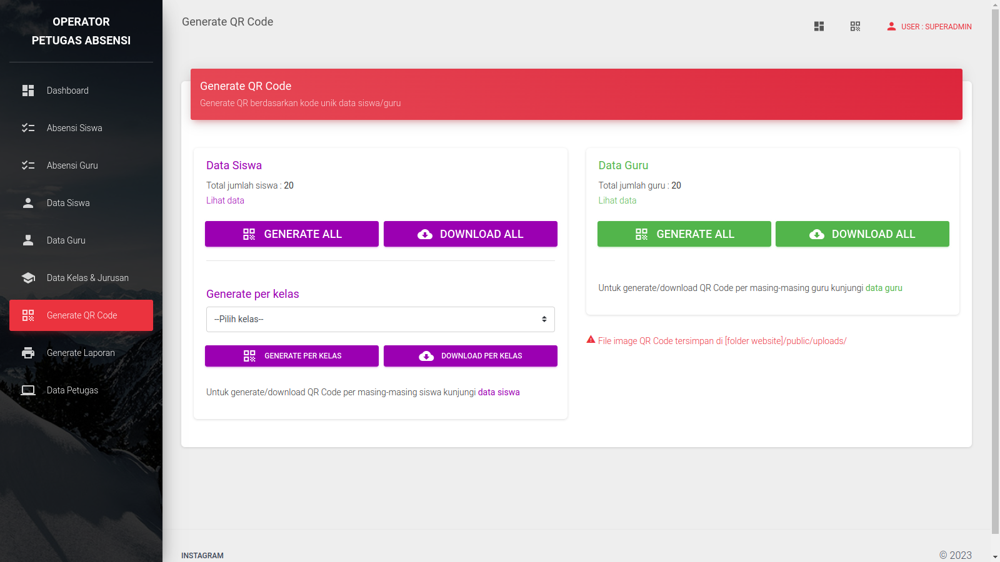 | 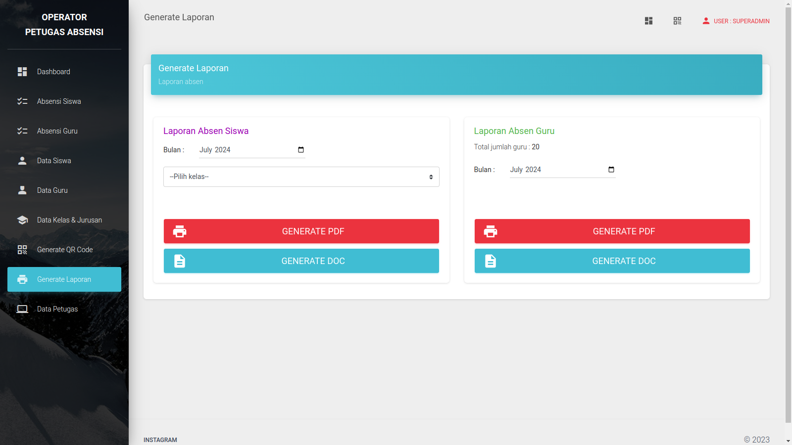 |

## Cara Penggunaan

> [!CAUTION]
>
> ### Persyaratan
> 
> - [Composer](https://getcomposer.org/).
> - PHP 8.1+ dan MySQL/MariaDB atau [XAMPP](https://www.apachefriends.org/download.html) versi 8.1+ dengan mengaktifkan extension `intl` dan `gd`.
> - Pastikan perangkat memiliki kamera/webcam untuk menjalankan qr scanner. Bisa juga menggunakan kamera HP dengan bantuan software DroidCam.
>
> ### Instalasi
> 
> - Clone/Download source code proyek ini.
>
> - Install dependencies yang diperlukan dengan cara menjalankan perintah berikut di terminal:
>
>   ```shell
>   composer install
>   ```
>
> - Jika belum terdapat file `.env`, rename file `.env.example` menjadi `.env`
>
> - Buat database `db_absensi`(sesuaikan dengan yang terdapat di `.env`) di phpMyAdmin / mysql
>
> - Jalankan migrasi database untuk membuat struktur tabel yang diperlukan. Ketikkan perintah berikut di terminal:
>
>   ```shell
>   php spark migrate --all
>   ```
>
> - Jalankan web server (contoh Apache, XAMPP, etc)
> - Atau gunakan `php spark serve` (atur baseURL di `.env` menjadi `http://localhost:8080/` terlebih dahulu).
> - Lalu jalankan aplikasi di browser.
> - Login menggunakan krendensial superadmin:
>
>   ```txt
>   username : superadmin
>   password : superadmin
>   ```
>
> - Izinkan akses kamera.

> [!TIP]
> 
> ### Konfigurasi
> 
> - Konfigurasi file `.env` untuk mengatur base url(terutama jika melakukan hosting), koneksi database dan pengaturan lainnya sesuai dengan lingkungan pengembangan Anda.
> 
> - Untuk mengubah konfigurasi nama sekolah, tahun ajaran logo sekolah dll sudah disediakan pengaturan (khusus untuk superadmin).
>
> - Logo Sekolah Rekomendasi 100x100px atau 1:1 dan berformat PNG/JPG.
> 
> - Jika ingin mengubah email, username & password dari superadmin, buka file `app\Database\Migrations\2023-08-18-000004_AddSuperadmin.php` lalu ubah & sesuaikan kode berikut:
>
>   ```php
>   // INSERT INITIAL SUPERADMIN
>   $email = 'adminsuper@gmail.com';
>   $username = 'superadmin';
>   $password = 'superadmin';
>   ```

## Kesimpulan

Dengan aplikasi web sistem absensi sekolah berbasis QR code ini, diharapkan proses absensi di sekolah menjadi lebih efisien dan terotomatisasi. Proyek ini dapat diadaptasi dan dikembangkan lebih lanjut sesuai dengan kebutuhan dan persyaratan sekolah Anda.

Jangan lupa beri star ya...⭐⭐⭐

## Contributing

Kami menerima kontribusi dari komunitas terbuka untuk meningkatkan aplikasi ini. Jika Anda menemukan masalah, bug, atau memiliki saran untuk peningkatan, silakan buat issue baru dalam repositori ini atau ajukan pull request.

## Donasi

[](https://paypal.me/xannxett?country.x=ID&locale.x=en_US)
[](https://saweria.co/xiboxann)

## Lisensi

[](./LICENSE)

## Authors

- [@ikhsan3adi](https://www.github.com/ikhsan3adi)
